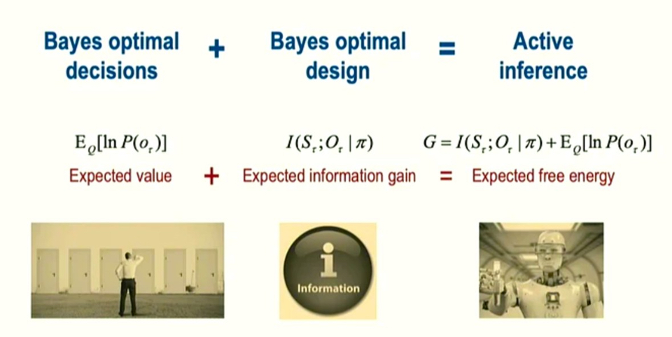
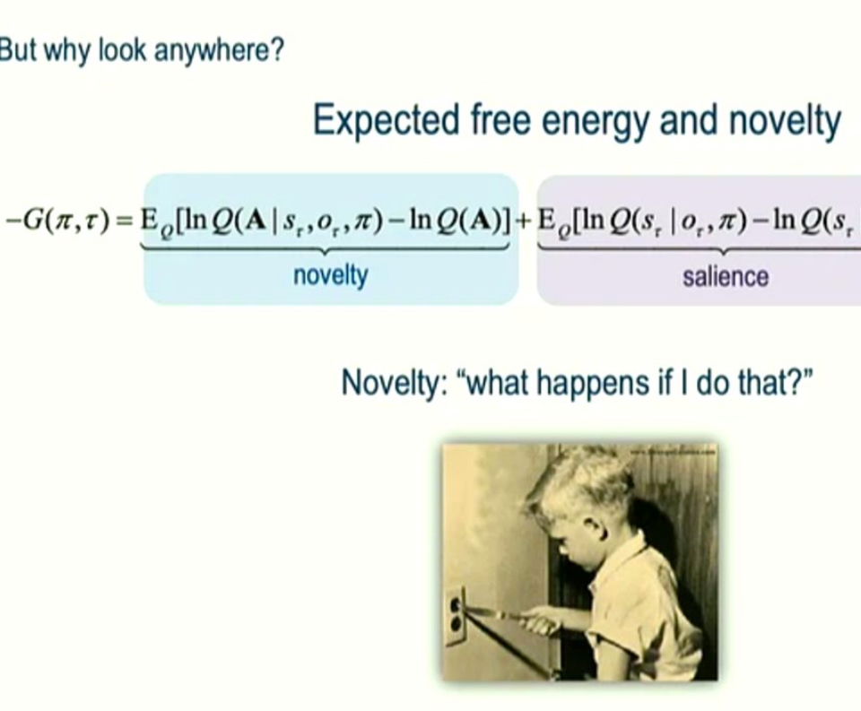

# Friston Energy Conservation Inference

* Prof. Karl J. Friston

## Key Papers

* https://www.fil.ion.ucl.ac.uk/~karl/

## Uncertainty Minimization

*  active inference
*  brain mapping + neuroimaging analysis methods
*  SPM + DCM
*  Gaussian Random Field theory
*  "active inference" - a theory of how brains work - which is somewhat related to Reinforcement Learning (RL)
*  Free Energy Principle (FEP) which describes how systems (biological or artificial) minimize uncertainty about their environment by inferring the causes of sensory inputs + acting to fulfil their prior beliefs or reduce uncertainty.
*  Agents (such as humans) try to minimize "variational free energy", actively measuring the difference between their brain's model of the world + its sensory experiences.  💡
*  active inference and reinforcement learning aren't completely similar: RL maximises an external reward signal, but active Inference minimises a combination of "surprise "(discrepancy between observations + expectations) + uncertainty (lack of confidence in beliefs) but also (2) creates a generative model of the environment that predicts sensory inputs, given internal states.
*  Presumably AI people are not incorporating intrinsic motivation into their algorithms 

## Topics

* Dynamic causal modeling
* Statistical parametric mapping
* Free energy principle (https://en.wikipedia.org/wiki/Free_energy_principle#Active_inference)
* active inference

## Blog posts

* https://jaredtumiel.github.io/blog/2020/08/08/free-energy1.html
* https://awjuliani.medium.com/a-gentle-introduction-to-the-free-energy-principle-03f219853177
* 

## Python Examples

* https://github.com/infer-actively/pymdp
* https://github.com/vschaik/Active-Inference
* https://pymdp-rtd.readthedocs.io/en/latest/notebooks/free_energy_calculation.html
* https://colab.research.google.com/github/infer-actively/pymdp/blob/master/docs/notebooks/pymdp_fundamentals.ipynb
* 

## Energy conservation 

Images from NeuroIPS 2024. 

